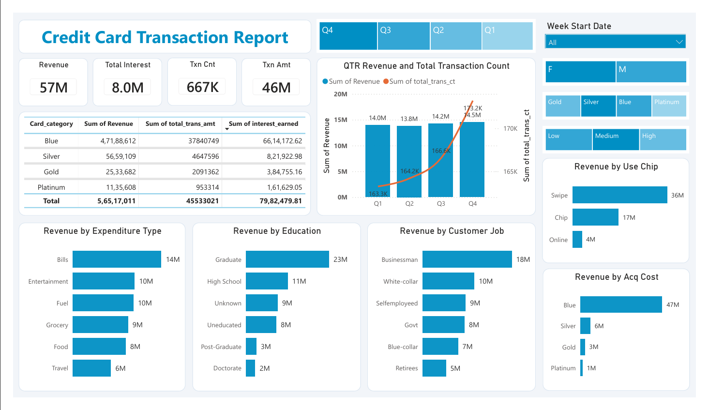
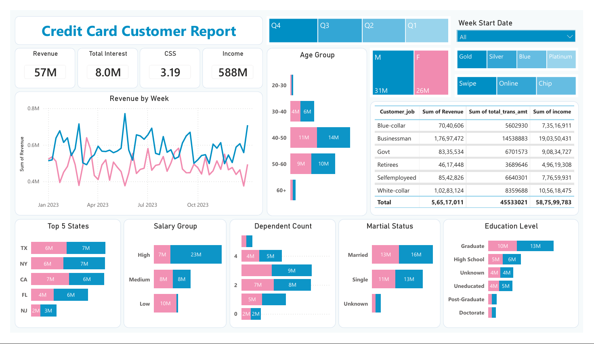

# Credit Card Financial Dashboard

An interactive **Credit Card Financial Dashboard** built using **Power BI** and **PostgreSQL** to analyze customer behavior, transaction trends, revenue performance, and spending patterns. The project transforms raw credit card data into meaningful business insights through dynamic visualizations and interactive reports.

---

## Project Overview

This project analyzes credit card customer and transaction data to provide valuable business insights. The data was imported into **PostgreSQL** using **pgAdmin**, connected to **Power BI**, and transformed using **Power Query**, **DAX**, and data modeling techniques.

The solution includes two interactive dashboards:

- **Credit Card Transaction Report**
- **Credit Card Customer Report**

---

## Dashboard Preview

### Credit Card Transaction Report



---

### Credit Card Customer Report



---

## Features

- Interactive KPI cards
- Weekly and quarterly revenue analysis
- Customer demographic analysis
- Revenue by expenditure type
- Revenue by education level
- Revenue by occupation
- Revenue by card category
- Revenue by payment method
- Customer segmentation by age, income, gender, and marital status
- Dynamic slicers for interactive filtering

---

## Tech Stack

- Power BI Desktop
- PostgreSQL
- pgAdmin 4
- Power Query
- DAX
- CSV Datasets

---

## Project Structure

```text
Credit-Card-Analysis-Dashboard
│
├── Dashboard
│   └── Credit_Card_Report.pbix
│
├── Reports
│   ├── Credit_Card_Financial_Dashboard_Transaction.pdf
│   └── Credit_Card_Financial_Dashboard_Customer.pdf
│
├── Dataset
│   ├── credit_card.csv
│   ├── customer.csv
│   ├── cc_add.csv
│   └── cust_add.csv
│
├── Images
│   ├── transaction-report.png
│   └── customer-report.png
│
└── README.md
```

---

## Dataset

The project uses four CSV files:

- `credit_card.csv`
- `customer.csv`
- `cc_add.csv`
- `cust_add.csv`

The additional datasets were imported to include **Week 53** customer and transaction records.

---

## Database

The datasets were imported into a **PostgreSQL** database using **pgAdmin's Import/Export Data** feature and connected to Power BI for reporting and analysis.

---

## DAX Measures & Calculated Columns

### DAX Measures

- Revenue
- Current Week Revenue
- Previous Week Revenue
- Week-over-Week (WoW) Revenue
- Week Number

### Calculated Columns

- Age Group
- Income Group

---

## Dashboard KPIs

### Transaction Dashboard

- Total Revenue
- Total Interest
- Transaction Amount
- Transaction Count

### Customer Dashboard

- Revenue
- Total Interest
- Customer Satisfaction Score (CSS)
- Customer Income

---

## Key Insights

- Analyze weekly and quarterly revenue trends.
- Compare spending across expenditure categories.
- Understand customer demographics and spending behavior.
- Evaluate revenue by occupation, education, and card category.
- Monitor customer satisfaction and income distribution.
- Filter reports dynamically using interactive slicers.

---

## How to Run

2. Import the CSV files into PostgreSQL using **pgAdmin**.
3. Open `Credit_Card_Report.pbix` in **Power BI Desktop**.
4. Update the PostgreSQL connection if required.
5. Refresh the report.

---

## Skills Demonstrated

- Power BI
- PostgreSQL
- Power Query
- DAX
- Data Modeling
- Data Visualization
- Dashboard Design

---

## Author

**Hrithik Doiphode**

If you found this project useful, consider giving it a ⭐ on GitHub.
